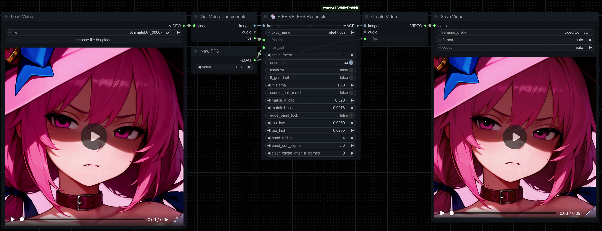
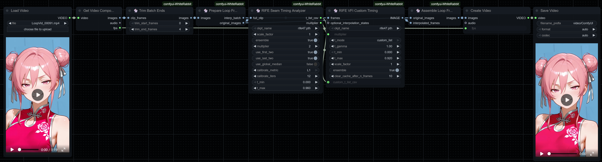
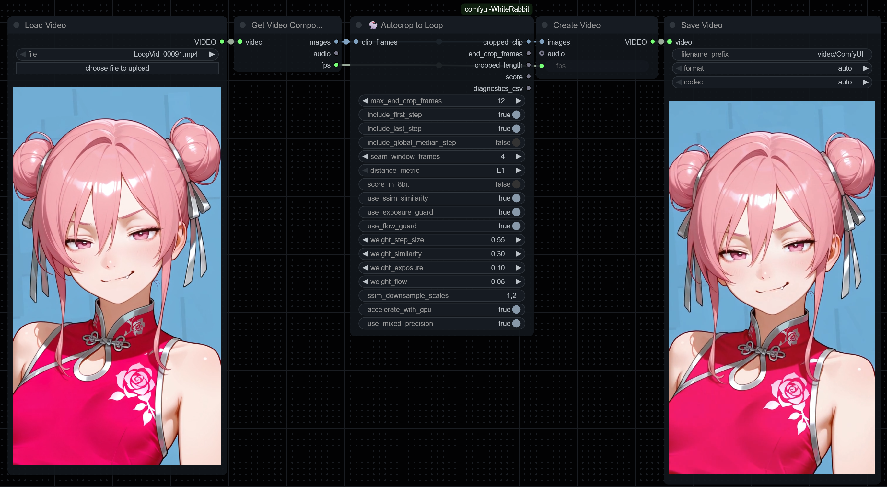
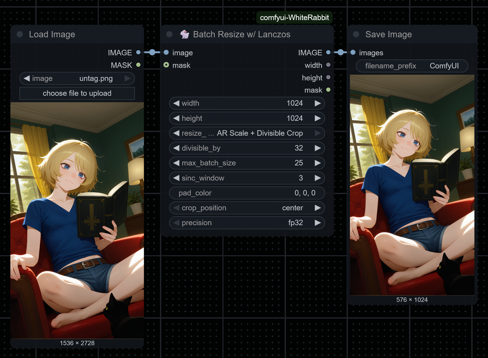
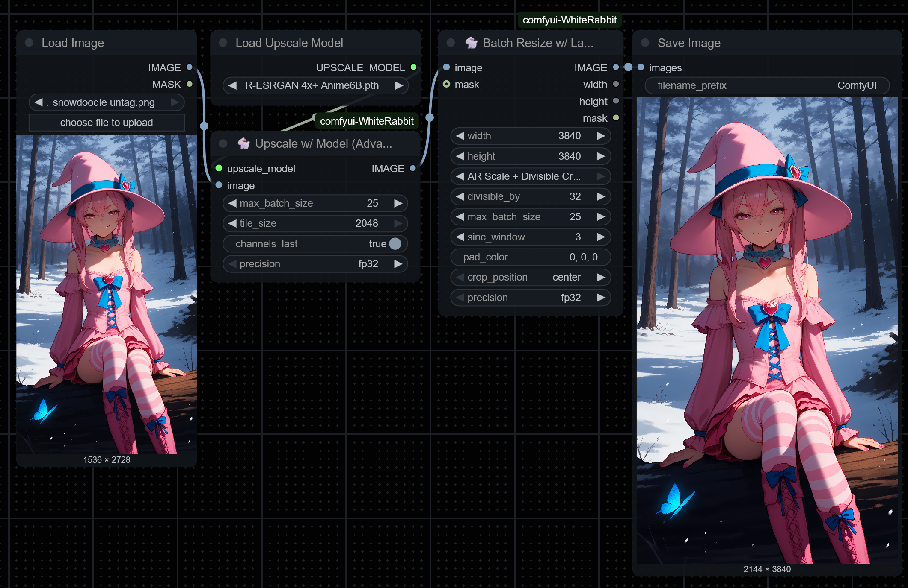

# WhiteRabbit: Master the Flow of Time 🐇
**English** | [简体中文](README_zh-CN.md)

This is **comfyui-WhiteRabbit**, a nodepack designed to help you work with video from within ComfyUI.

The Rabbit's specialty is looping through time to help you create seamless looping video, but that's not all she brings to the tea party. Quality, arbitrary framerate resampling and super fast image resizing are also part of the kit!

While some of these nodes certainly can be used for single-image tasks, every one of them is designed with efficient **batch handling** in mind and that means the performance gains compound, letting you process whole video clips as fast as possible within your hardware constraints.


## Installation

WhiteRabbit supports two layouts:

1) **External base pack (preferred when present)**: `custom_nodes/comfyui-frame-interpolation/`
2) **Vendored fallback (bundled here)**: `vendor/`

**Quick install:**
1. Drop the **comfyui-WhiteRabbit** folder into `ComfyUI/custom_nodes/`.
2. Install this node’s requirements:
   ```bash
   pip install -r requirements.txt

**Optionally**, you can install [ComfyUI-Frame-Interpolation](https://github.com/Fannovel16/ComfyUI-Frame-Interpolation) inside of your custom_nodes/ folder. WhiteRabbit will detect it and use resources from there. Especially handy if you already use it, since it avoids keeping two versions of the RIFE models.

### Python requirements

This node relies on ComfyUI’s core packages (e.g., `torch`, `torchvision`, `numpy`, `einops`, `pyyaml`) that are already provided by ComfyUI. Your **node-local** `requirements.txt` only adds:

```
packaging
torchlanc
```

## The Nodes

This pack of nodes helps you solve some of the trickiest problems in video creation.

### Time Benders

These nodes bend time itself to add or remove frames, all powered by the **RIFE** interpolation model. For a slight speed boost, they’re optimized to work together, caching the RIFE model for small efficiency gains in multi‑RIFE workflows.

- **RIFE VFI Interpolate by Multiple**: The basic tool for frame interpolation. Multiply your frames by 2×, 4×, etc., and it’ll generate the new frames needed to make your video silky smooth.
- **RIFE VFI FPS Resample**: A master of time travel. Convert your video to a specific target frame rate, automatically handling both adding and dropping frames as needed. Includes features to prevent common artifacts like flicker for a clean result.
- **RIFE VFI Custom Timing**: Ready for total control? Place every new frame with surgical precision. Create custom speed ramps or smooth out specific moments by providing a custom timing list.
- **RIFE Seam Timing Analyzer**: The perfect companion to the custom timing node. Automatically calculates the exact timing for a seamless loop, giving you the CSV values you need to make your transition feel flawless.


> *Example:* The **RIFE VFI FPS Resample** node is a master of time, resampling your video to a new frame rate. Try for yourself; the workflow is attached!

### Loop Masters

Making a seamless video loop can feel like a riddle. These nodes give you the keys to the perfect, continuous loop.

- **Prepare Loop Frames**: The first step. This node takes your entire video and prepares the loop "seam" by isolating the last and first frames into a separate batch. This little pair is all your interpolator needs to get started on the transition.
- **Assemble Loop Frames**: The final piece. After your interpolator works its magic, this node takes your original video and appends the new seam frames to the end, assembling your complete, continuous loop.
- **Autocrop to Loop**: Don't get lost in the forest of frames! This clever node intelligently analyzes your video to find the best possible place to crop from the end, ensuring your loop flows as smoothly as can be.
- **Trim Batch Ends**: A simple tool for trimming a fixed number of frames from the beginning or end of your clip, perfect for removing unwanted intros or outros.
- **Roll Frames**: Change the order of the images in a batch cyclicly. In the context of a loop, this will change on what frame your loop starts.
- **Unroll Frames**: Undo the work done by the above node; you may want to roll frames for a specific process (like interpolation) before returning them to their original order. This node comes with the ability to add a frame multiplier to put it in sync with a **RIFE VFI Interpolate by Multiple** that comes before.


> *Example:* Stitch a seamless loop with **Prepare Loop Frames** ➜ **RIFE Seam Timing Analyzer** ➜ **RIFE VFI Custom Timing ➜ **Assemble Loop Frames**. You can drop this png into ComfyUI and take it for a test drive!


> *Example:* The best loop is the one you already have. **Autocrop to Loop** can help you find the best end frame by analyzing the visual difference and timing between trailing frames in your clip.

### Post-Processing

These nodes play support!

- **Batch Resize w/ Lanczos**: Fast, principled, and uncompromising in quality. This CUDA‑accelerated node resizes a batch of images (or your single images, of course) using the high‑quality Lanczos algorithm written for PyTorch; [TorchLanc](https://github.com/Artificial-Sweetener/TorchLanc). It’s dramatically faster than CPU alternatives like Pillow's own Lanczos, with potential for up to a *10× speed increase*.
- **Upscale w/ Model (Advanced)**: A version of ComfyUI's own "Upscale Image (Using Model)" but with direct controls exposed for batch size and tiling which can help speed up scaling dramatically if you tune the numbers to your system.
- **Pixel Hold**: Can be used to reduce video flicker and clean up static parts of a video by reducing small fluctuations caused by video diffusion or compression. There is the potential to use this creatively because it can also take an input image as its baseline.
- **Watermark**: For single images or batches. Very quick, especially when compared to doing the same task in pro editing tools.


> *Example:* Resize images quickly with **Batch Resize w/ Lanczos**. Workflow attached!!


> *Example:* Use **Upscale w/ Model (Advanced)** in concert with **Batch Resize w/ Lanczos** to reach a specific target size like so. The image is holding onto the workflow for you.


> *Example:* Apply a watermark to each frame rapidly with smart configuration options. Workflow included.

## License & Acknowledgements
- **Project License:** GNU Affero General Public License v3.0 (**AGPL‑3.0**). Please read the full [LICENSE](LICENSE) included with this repo! The AGPL-3.0 is a strong copyleft license. If you convey the software, you must provide its corresponding source; and if you let users interact with a modified version over a network, you must offer them that modified version’s corresponding source.

- **Dependency License (MIT):** This project **vendors** minimal components from **[ComfyUI-Frame-Interpolation](https://github.com/Fannovel16/ComfyUI-Frame-Interpolation)** for reliability. These files are licensed under MIT by **[Fannovel16](https://github.com/Fannovel16)** and **[contributors](https://github.com/Fannovel16/ComfyUI-Frame-Interpolation/graphs/contributors)**; see the included license at `LICENSES/MIT-ComfyUI-Frame-Interpolation.txt`:
  - `vendor/vfi_utils.py`
  - `vendor/rife/__init__.py`
  - `vendor/rife/rife_arch.py`
- From **[ComfyUI-Frame-Interpolation](https://github.com/Fannovel16/ComfyUI-Frame-Interpolation)**, it also adapt small portions within [`interpolation.py`](interpolation.py).
- UI for **Batch Resize w/ Lanczos** was inspired by the similar node from [Kijai](https://github.com/kijai/)'s excellent [KJNodes](thub.com/kijai/ComfyUI-KJNodes).

### Research citations

This node pack uses **RIFE (IFNet)** for video frame interpolation. You can read the white paper [here](https://ar5iv.labs.arxiv.org/html/2011.06294).

```bibtex
@inproceedings{huang2022rife,
  title={Real-Time Intermediate Flow Estimation for Video Frame Interpolation},
  author={Huang, Zhewei and Zhang, Tianyuan and Heng, Wen and Shi, Boxin and Zhou, Shuchang},
  booktitle={European Conference on Computer Vision (ECCV)},
  year={2022}
}
```
---

## From the Developer ❤️

I hope you love using these nodes as much as I loved putting them together!

- **Buy Me a Coffee**: You can help fuel more projects like this at my [Ko-fi page](https://ko-fi.com/artificial_sweetener).
- **My Website & Socials**: See my art, poetry, and other dev updates at [artificialsweetener.ai](https://artificialsweetener.ai).
- **If you like this project**, it would mean a lot to me if you gave me a star here on Github!! ⭐
