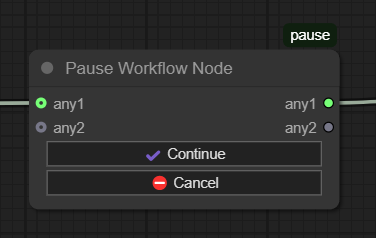

# ComfyUI Pause Workflow Node



## Features
- Adds a pause point in workflows
- Requires manual confirmation to continue
- Preserves data flow between nodes with 2 pass-through inputs/outputs

## Use Cases
1. Pause to check whether result is worth upscaling
2. Check for artifacts before continuing

## Installation

### ComfyUI Manager

Search for `ComfyUI-pause` in the Node Palette

### Manually

1. Clone this repo to `ComfyUI/custom_nodes`
2. Restart ComfyUI

```bash
cd ComfyUI/custom_nodes
git clone https://github.com/wywywywy/ComfyUI-pause.git
```

## Usage
1. Add **Pause Workflow Node** from the `utils` category
2. Connect inputs/outputs as needed
3. Execute workflow - it will pause at this node
4. Click the **Continue** button on the node to resume
5. Or click the **Cancel** button to cancel the whole workflow instead

## License
MIT